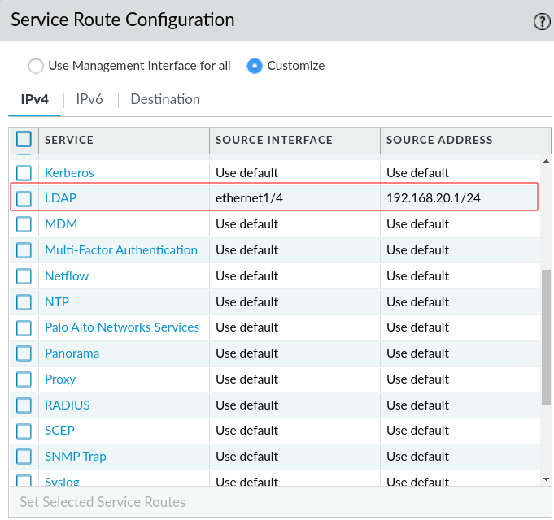
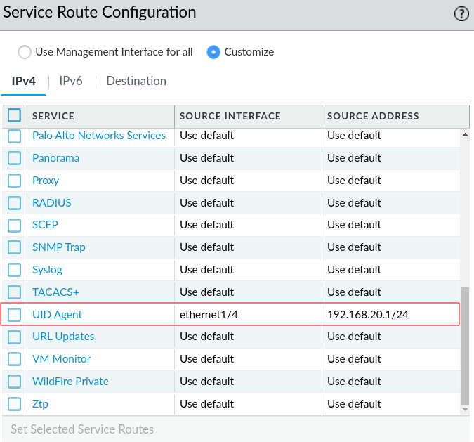
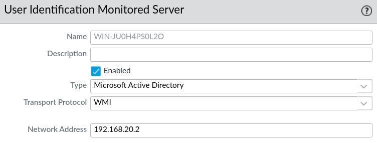
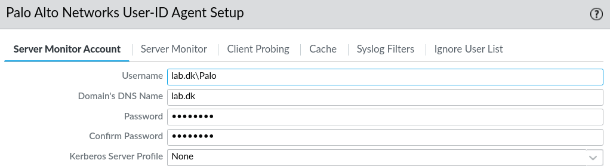
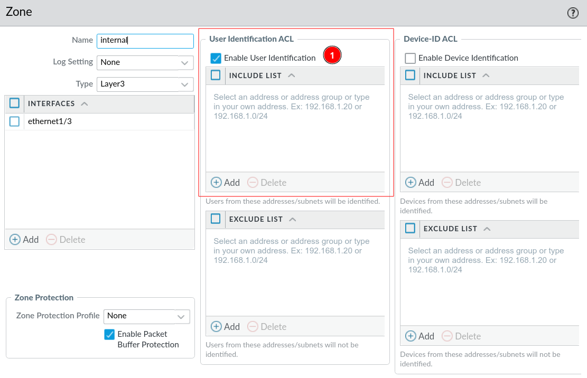
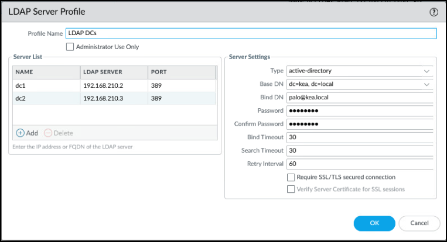
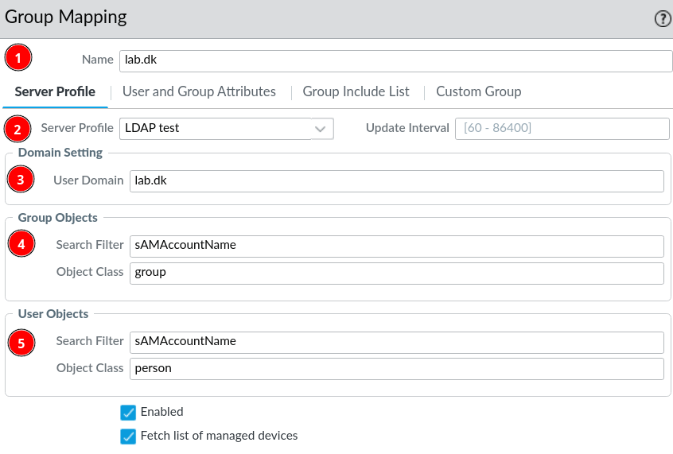
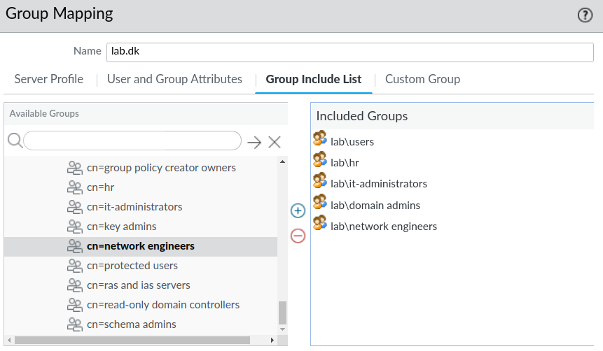
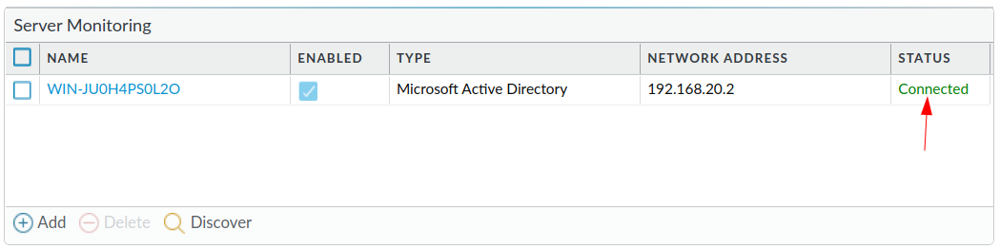

# Integration with Windows AD via LDAP

The goal of this section: 
* Being able to log traffic of users and see which user is generating the traffic
* Being able to create policies based on Active Directory Users & Groups
This can be achieved with LDAP and integration with the Active Directory, this way IPs will be mapped to user credentials.

## Log User Setup in AD

In short you need to configure the following steps on the DC/AD.

1. Create a user - the user should only be used for the authentication and logging to the firewall.
2. Add him to the groups; ***Event Log Reader***, ***Distributed COM Users*** and possibly the ***Remote Desktop Users*** if you want to be able to log remote logins to devices.
te Desktop Use

!!! tip
    If the above groups does not work, try to add the user to the *administrators group*.

!!! note
    Not quite sure about Remote Desktop Users, if it's correct that the *log user* must be a member of this group in order to log remote access to devices in the AD.

## Setup on Palo Alto Firewall

There are a couple of prerequisities, that must setup up in order to make the LDAP integration work:

### Service Route Configuration

***Device*** &rarr; ***Setup*** &rarr; ***Services*** &rarr; ***Service Route Configuration***

You must set the necessary protocols (*LDAP & UID Agent*) to the interfaces where AD is gonna authenticate the firewall through. Otherwise the firewall will only able to receive LDAP traffic through the management interface.

### Server Monitor

***Device*** &rarr; ***User Identification*** &rarr; ***User Mapping*** &rarr; ***Server Monitoring*** &rarr; ***Add***

This configures the connection to the DC, that's going to be integrated with LDAP.

1. Give a name, can be anything, but makes sense to call it the hostname of the DC.
2. Set type to Microsoft AD
3. Set the Transport Protocol to WMI
4. Configure the IP of the DC

### User-ID Agent

***Device*** &rarr; ***User Identification*** &rarr; ***User Mapping*** &rarr; ***User-ID Agent Setup*** &rarr; ***Gear icon*** &rarr; ***Server Monitor Account***

Remember to use the domain that you setup, as well as the Log-user that we setup above.

The rest of the tabs in this window should be left as they are default.

### Enable UID on zones

Remember to enable *User Identification* for the zones, where you want to log users from AD.

***Network*** &rarr; ***Zones*** &rarr; ***the-zone-where-DC-is-connected / the-zone-where-clients-are-connected***

### LDAP Server Profile

We will need the LDAP Server profile in order to pull out users and groups from AD. The profile is going to be used later in the configuration.

***Device &rarr; Server Profiles &rarr; LDAP &rarr; Add***

1. Set the servers and ports
2. Set server settings accordinglingy
    * Type: AD
    * Base DN: The domain name, seems it must be in the form of "dc=*domain*, dc=*local*
    * Bind DN: The user, made earlier in the docs, that is going to be doing the AD integration
    * Password: The users password
    * Untick *Require SSL/TLS secured connection*

!!! SSL/TLS
    This should be mandatory, but we have yet to make it work. Needs more work.

### Group Mapping

In order to be able to make *security polices* based on groups, you must include them in the ***Group Mapping*** configuration.

***Device*** &rarr; ***User Identification*** &rarr; ***Group Mapping Settings*** &rarr; ***Add***

### Verify Setup

#### AD Server Connection

***Device*** &rarr; ***User Identification*** &rarr; ***Server Monitoring***

The status should be *Connected* in green letters.

#### Logs

***Monitor &rarr; Traffic / User-ID***

Check the logs for usernames that you recognize from AD, while logging in and out with different users on a client device.
