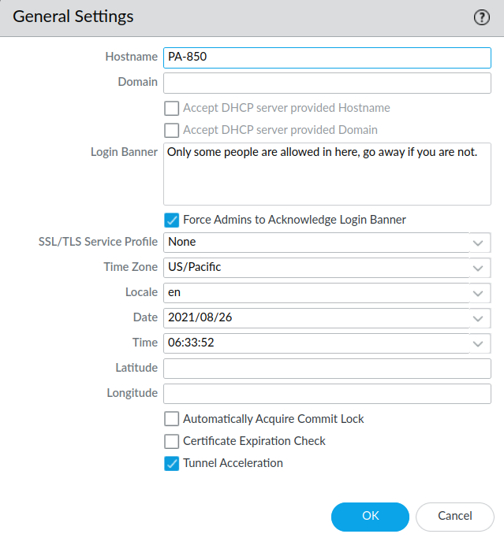

# General Settings

It's usually a good idea to give your servers and other important devices a proper hostname. On a Palo Alto firewall, this can be configured together with the *domain, time, timezone* and *login banner* within ***Device*** tab --> ***Setup*** in the sidebar to the left --> ***Management*** tab --> then find the ***General Settings*** window within the ***Management*** dashboard. 

