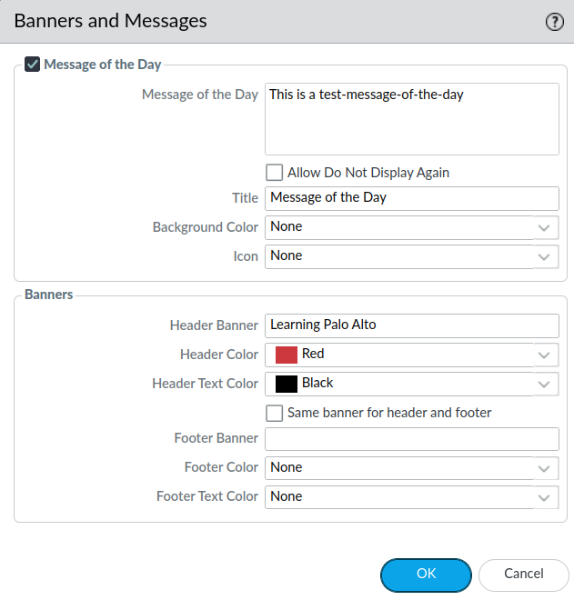

# Message of the Day (motd) & Banner

Motd can be configured to give other administrators information about something concerning the firewall.
Motd is configured through the ***Device*** tab --> ***Setup*** --> ***Management*** tab, here find the *** Banners and Messages*** window on the ***Management*** dashboard.
The configurations are fairly self explanatory. It's also here you can find the configurations for the *banner* (top and/or bottom) of the webpage.

