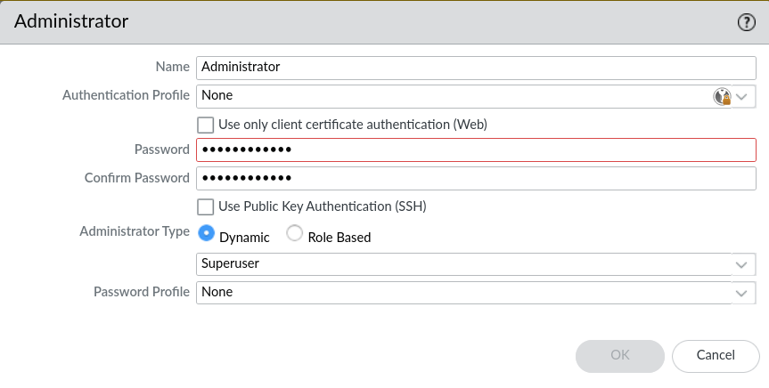

# Creation of administrators

Within Palo Alto, there are no "normal" users, only administrators. Administrators can have different *roles*, fx a -logs-only-administrator-.

To add administrators go to ***Device*** --> ***Administrators*** and click ***Add***

* ***Authentication Profile*** can be used when you fx are connecting to Active Directory through LDAP.
* Authentication can also happen with SSH-keys instead of normal passwords.
* The ***Administrator Type*** can be ***Dynamic*** or ***Role Based***.
    * ***Dynamic*** is build in sever roles, like the ***Super User***, ***Super User (read-only)***, etc.
    * The ***Role Based*** server roles can be defined by the ***Super user***, at least to begin with.
* ***Password Profile*** can be specified if you want to make sure that administrators are using more secure passwords, with parameters like:
    * Capital letters
    * Normal letters
    * Numbers
    * Symbols
