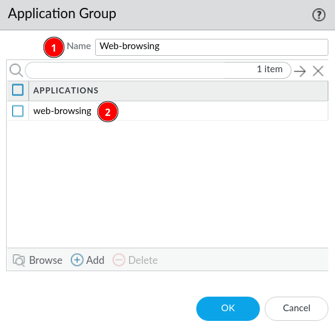

# App-ID

App-ID makes it possible to filter traffic based on applications. The firewall can determine what application is running trough the firewall based on application signatures, application protocol decoding etc. This means that the firewall can detect an application even, when it tries to circumvent the firewall using different ports, protocols or encryption (SSH/SSL). It's also possible for App-ID to detect if traffic tries to mask itself as a different application.

## How to make a security policy based on App-ID

In this example we want to block all web-browsing traffic based on App-ID.

### Application Group

1. Create new Application group by going to ***Objects*** &rarr; ***Application Group*** &rarr; ***Add***

2. Give it a name and add the application you want filtering for. In this case Palo Alto already have an application, called ***"Web-browsing"*** we assume this application actually hit multiple signatures for different browsers, ports etc.

3. Now we just need to make a new ***Security Policy***, you can either create one from scratch or clone an existing one and modify it. See how to create ***Security Policy*** [here](../policies/policies.md).
