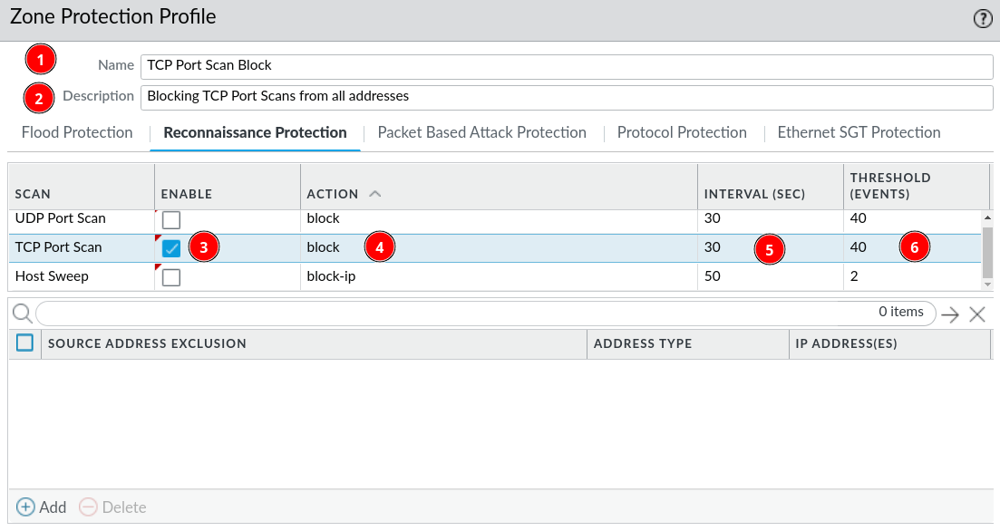

# Zone Protection

***Zone Protection*** is used to defend the network zones from:

* flood attacks (***Flood Protection***)
* reconnaissance attempts (***Reconnaissance Protection***) 
* packet-based attacks (***Packet Based Attack Protection***)
* attacks that use non-IP protocols. (***Protocol Protection***)

*** Zone Protection*** is setup through profiles and the profile can be applied to several *zones*.

At this point we have only done *reconnaissance protection*.

## Reconnaissance Protection

This type of zone protection defends against network mapping, where the attacker want's to get an overview of the network or a map of the network, by scanning the network or single hosts for open ports and IPs. ***Reconnaissance Protection*** can protect in three different ways:

* **UDP Port Scan** (the attacker scans hosts on the network for open UDP ports)
* **TCP Port Scan** (the attacker scans hosts on the network for open TCP ports)
* **Host Sweep** ( the attacker scans the network for hosts and IPs )

When configuring these protections you can set the *interval* and the *threshold*, which means so many port scans or host sweeps can happen within the *interval* before the protection triggers the *action*.

**Actions:**

- Allow - Nothing happens other than log-entry
- Alert - Generates alert (alerts can be configured to send emails to administrators)
- Block - Drops subsequent packets from source to destination for the remainder of the *interval*
- Block IP - Drops subsequent packets based on a *duration* and based on either *source IP* && *destination IP* or just the *source IP*.

### Reconnaissance Protection Configuration

***Network &rarr; Network Profiles &rarr; Zone Protection &rarr; Add***

