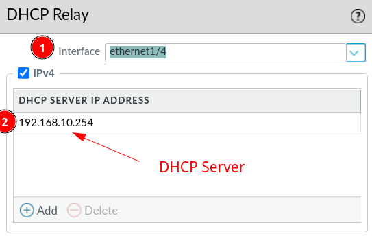

# DHCP Relay

DHCP Relay is a must have in case you have DHCP servers connected on different networks than the clients. 

Let's say a client is trying to get a hold of a DHCP server through broadcasts on the network `192.168.10.0/24`, but the server is on the `192.168.20.0/24`, both are connected to the firewall on different interfaces. In such an example the broadcast would stop at the firewall interface connected to the `192.168.10.0/24` network. To remedy this, you can setup the interface connected to the clients who needs a DHCP server with a DHCP Relay and the address off the DHCP server. Whenever the firewall receive DHCP packets it will now send (unicast) them on to the DHCP server. 

## Configuration

**Network --> DHCP --> DHCP Relay --> Add**

1. Choose the correct interface (the one where DHCP clients is connected to)
2. Add the IP of the DHCP server

