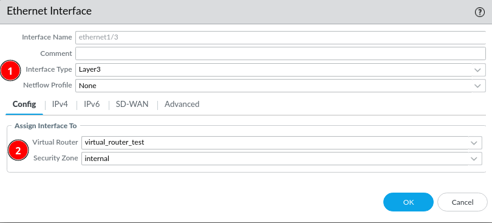
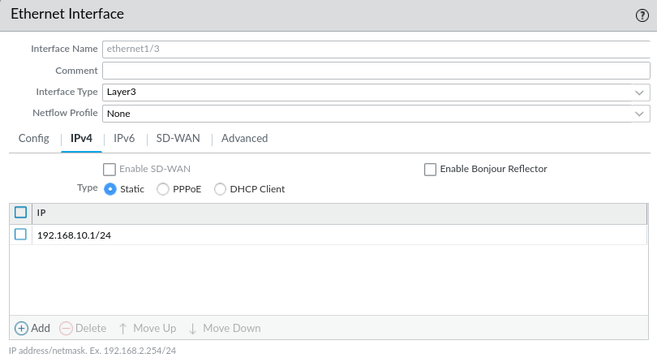
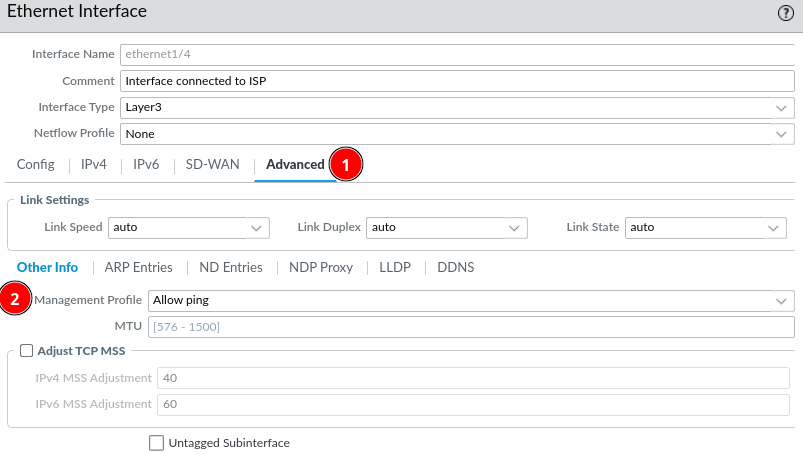
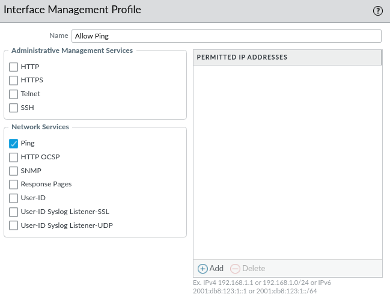

# Interfaces

The interfaces section is used to modify and setup the physical interfaces on the firewall. Interface can work as different types, such as *high-availability, layer 2, layer 3* etc. You can also assign the interfaces to the forementioned *zones* and *virtual routers*. The interface usually also needs to have an IP-assigned.

Remember to assign an interface to each zone, if you need routing between them.

For testing purposes it might be a good idea to allow ping, and perhaps other services on the interfaces. This can be done through a ***Management Profile***. 

