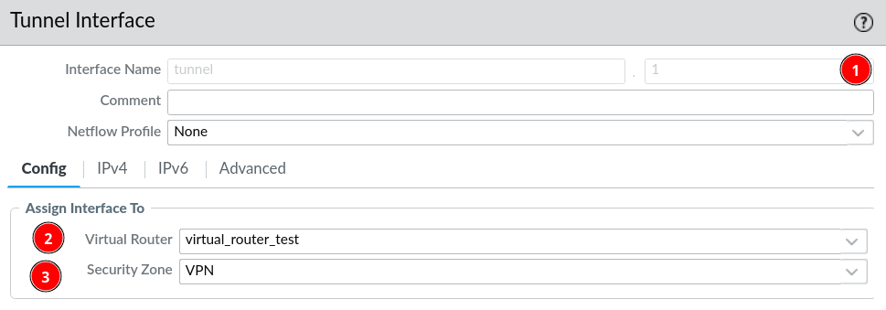
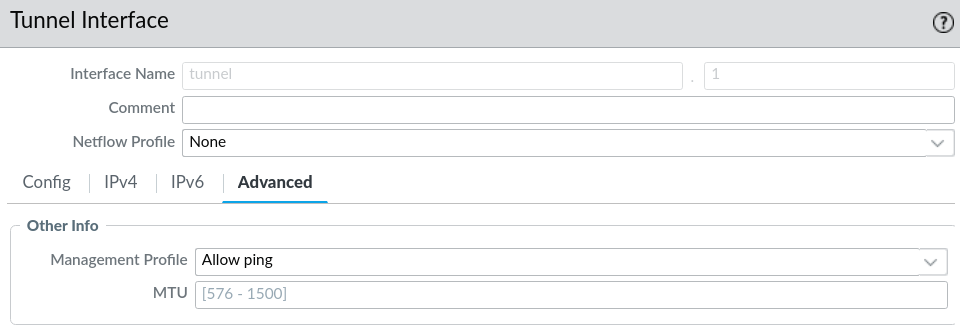
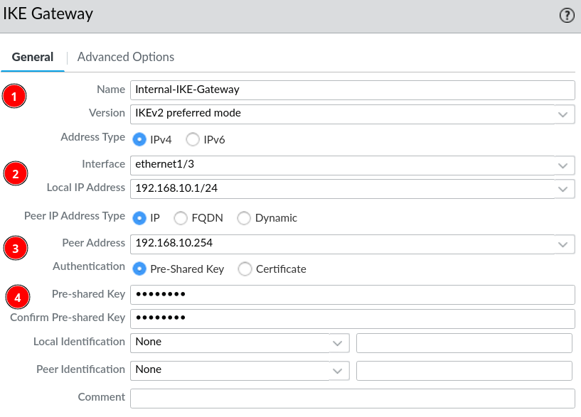
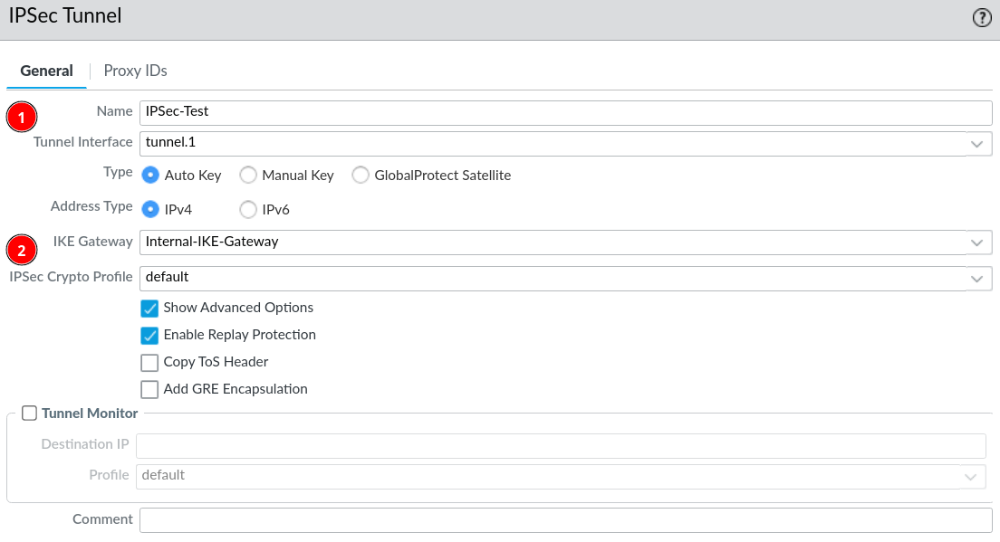

# Site-to-Site VPN

Shortly, a VPN is an encrypted tunnel between two end-points. In this case we setup site-to-site VPN with IPsec between a Palo Alto firewall and a pfSense firewall. Meaning that all devices behind the firewall are going to communicate with through the VPN, if routed through the VPN.

With IPsec there is two phases before the tunnel can be established. Each phase is a negotiation between the two peers, that are trying to establish the IPsec tunnel.

## Phase 1

This phase must be completed in order to continue to phase 2.

In phase 1 the two gateways exchange credentials and agree on which settings to use during the phase. When the negotiation is complete the two gateways will have a *Security Association* (SA) that specifies how long they have to complete phase 2 before phase 1 has to be renegotiated. 

## Phase 2

When phase 1 is complete and the tunnel has been secured and authenticated phase 2 begins. In this phase 2 the gateways negotiate the phase2 or IPsec SA, which specifies:

* What to send across the VPN
* How to encrypt the data
* How to authenticate the traffic.

## Palo Alto Setup of IPsec Site-to-Site

### Tunnel interfaces

Network &rarr; Tunnel &rarr; Add

1. Assign a number to the tunnel
2. Assign the virtual router
3. Assign it to a network zone

For testing, assign a management profile to the tunnel that allows pings.

### IKE Gateways

Network &rarr; IKE Gateways &rarr; Add

1. Set the name and preferred IKE version
2. Choose the interface that VPN should run on, and give it an IP address
3. Assign a peer address, whether its IP, FQDN or Dynamic
4. Choose authentication method and write in the password if PSK is chosen.

### IPsec Tunnel

Network &rarr; IPsec Tunnnels &rarr; Add

1. Give the tunnel a name and assign it the tunnel interface (tunnel.1)
2. Assign the IKE gateway that was named in the previous step.

