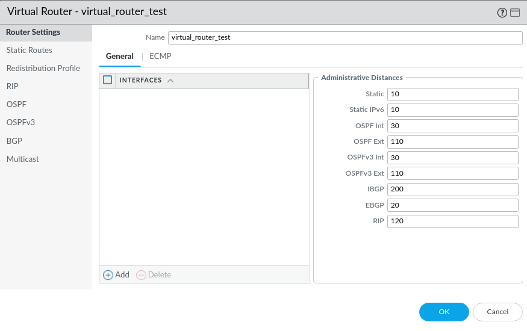

# Virtual Routers

Virtual routers are used to route internally in the firewall between two or more interfaces. The virtual router can also utilise routing protocols like BGP, OSPF and RIP.

Here you can also add the interfaces to the virtual router. In this case we will associate the virtual router when modifying the interfaces.

Find the virtual routers through the ***Network*** tab --> ***Virtual Routers***, and click ***Add*** in the bottom to make a new virtual router.

