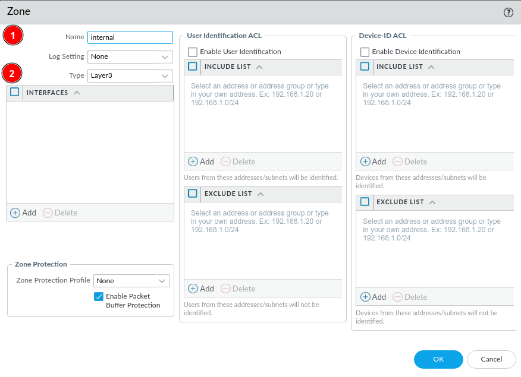

# Zones

When setting up a firewall you probably want to segment your network into different zones, like *trust* and *untrust* or *internal* and *external*. 

Within the ***Network*** tab --> ***Zones*** you can modify existing zones or add new zones.

In this case we just give the zone a name and the type ***Layer 3***. You can also add interfaces, but in this wiki we will do that when setting up interfaces.

