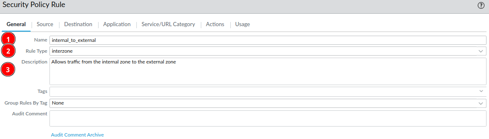
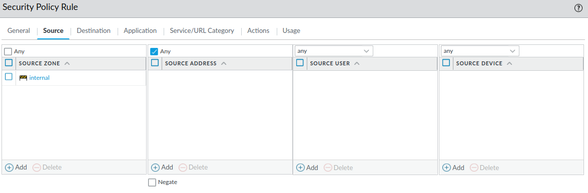
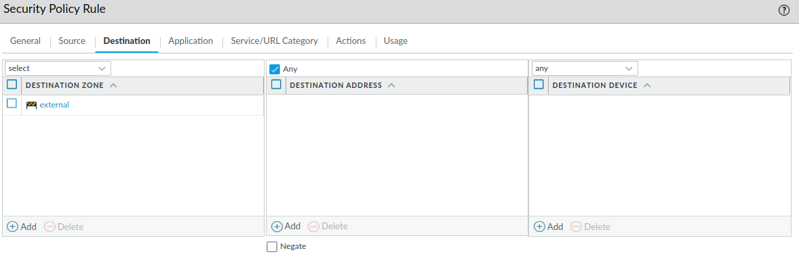
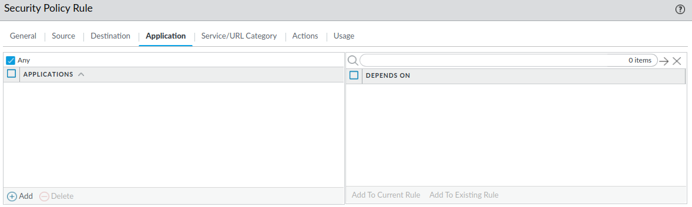
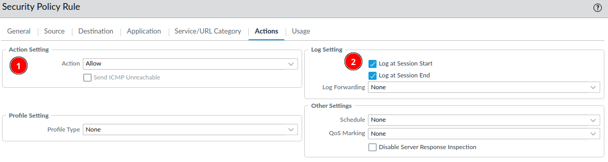

# Policies

When allowing and denying traffic with a Palo Alto firewall, you must create security policies within the security policy rule base, which is basically just a list of the all the security policies (rules).

Security polices can be based on:

* source and destination zones
* source and destination IP-address
* source user
* source and destination device
* applications 
* services & URL's

A security policy needs an *action*, which can be:

* **Allow**
* **Deny** (notifies sender that packages is denied)
* **Drop** (Drops the package without notifying sender)

### Security Policy Creation
Go to ***Policies*** --> ***Security*** and click ***Add***.

#### General

#### Source

#### Destination

#### Application

#### Action
It's always a good idea to log everything, in most real life use-cases it's too much for the firewall to log everything at the ***Session Start***, but for learning purposes we can do it. If you need to troubleshoot a problem you can always edit the security policy and check the ***Session Start***.

