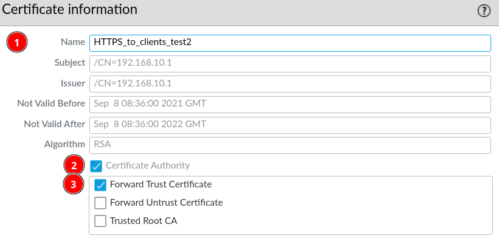
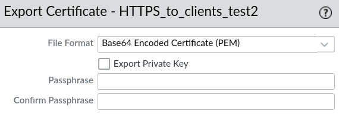
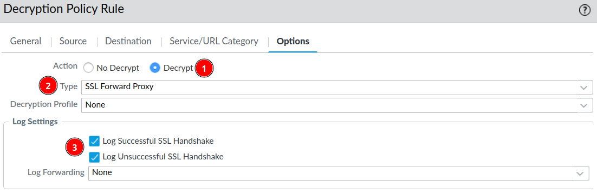
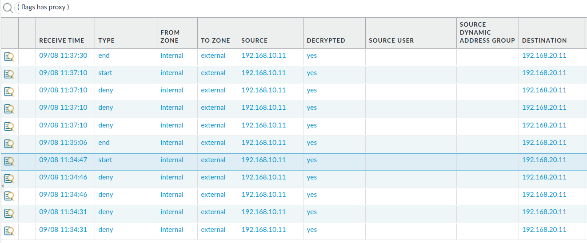

# SSL Forward Proxy (SSL/TSL Decrypting)

Web-traffic is usually encrypted with HTTPS and SSL. It can be a problem for security specialists if they suspect malicious traffic or unintended sensitive information is sent through the firewall encrypted. Luckily it is possible to setup the Palo Alto firewall to decrypt the SSL traffic through certificates and decryption polices.

## What is a SSL Forward Proxy?

In this case the firewall is pretending to be the web-server that the clients on the internal network want's to connect to. Meaning that whenever a client want's to reach a website on the Internet, they are actually only conversing with the firewall and the firewall contacts the web-server on behalf of the client. It does this *transparently*, which is a fancy way of saying without the client or web-server knowing. So the client is encrypting it's SSL traffic with the public key of the certificate from the firewall, as such the firewall is able to decrypt the incoming traffic from clients with it's private key to the certificate.

## Configuration of a SSL Forward Proxy

### Generate the certificate

***Device --> Certificate Management --> Certificates --> Add***

1. Give it a name
2. Tick the ***Certificate Authority***
3. Tick the Forward Trust Certificate 

### Exporting the Certificate

The certificates must be available on the host devices, so we must export the certificate from the firewall. Under normal circumstances you would probably propagate the certificate to the host devices with a centralised deployment option like Active Directory. In this case we exported the certificate to CRT-file, popped onto a USB-device, moved and installed it on a test-client.

!!! warning
    Do not export the private key! Anyone with the private key can impersonate as the firewall.

***Device --> Certificate Management --> Certificates --> Chose Certificate --> Export Certificate***

On Windows the certificate must be installed to ***Trusted Root Certification Authorities***.

### Decryption Policy Configuration

***Polices --> Decryption --> Add***

For testing purposes we just leave the address source and destination as *any* and tick on the *Log Successful SSL Handshake* 

### Verify Configuration

A web-server with a working HTTPS/SSL configuration is needed, then just send traffic to/from a client to the web-server and observe if the traffic is decrypted on the firewall monitor.

